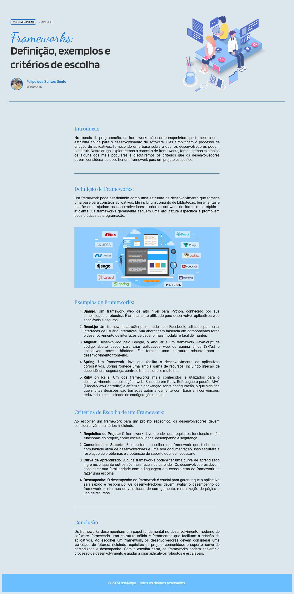

# Programação para WEB - Fatec Sorocaba

Este repositório tem o intuito de registrar as atividades realizadas na disciplina de Programação para Web do curso de Análise e Desenvolvimento de Sistemas da FATEC Sorocaba pela professora Denilce de Almeida Oliveira Veloso. 
O conteúdo da materia envolve conceitos de HTML, CSS, Javascript e Node.js que serão trabalhados ao longo de diversas atividades* no decorrer do semestre.

*A primeira atividade foi um formulário realizado em sala de aula, portanto não está presente no repositório.

 

## Atividade 2

 
 

Atividade teórica, o objetivo era fazer uma pesquisa sobre alguns temas disponibilizados, no meu caso, o tema foi Frameworks para desenvolvimento WEB, explorando a definição do termo, exemplos e seus critérios de escolha. A atividade foi entregue em PDF e está disponível no repositório, além disso, seu conteúdo será utilizado posteriormente na próxima atividade.

**Habilidades trabalhadas:** *Não se aplica*

 

## Atividade 3**

 
 

A proposta foi a de construir uma página com o conteúdo da pesquisa feita na atividade 2 utilizando os conceitos básicos de HTML como elementos semânticos, listas, parágrafos, imagens, e também alguns conceitos iniciais de CSS.

Para essa atividade, usei como inspiração o design de Milos Bojkovic disponível em: https://dribbble.com/shots/21592801-Blog-post-exploration

**Habilidades trabalhadas:** HTML e CSS

**Como o conceito de Media Query ainda não foi trabalhado em sala de aula, a resolução para a qual a página foi desenvolvida foi a de 720p.

 

Screenshot do projeto

 

  

 

## Atividade 4***

 
 

Para essa atividade o objetivo era de criar um site de notícias, utilizando os conceitos abordados em sala de aula de DIVs e flexbox.

Minha ideia foi de desenvolver uma página de notícias sobre games, para isso usei alguns conteúdos, chamadas e autores de matérias do portal da IGN Brasil, e também me fundamentei no design de Sajjad Sabbir disponível em: https://dribbble.com/shots/23159628-Game-News-Portal-UI-Design

**Habilidades trabalhadas:** HTML e CSS

***Como o conceito de Media Query ainda não foi trabalhado em sala de aula, a resolução para a qual a página foi desenvolvida foi a de 1080p.

 

Screenshot do projeto

 

  

 
